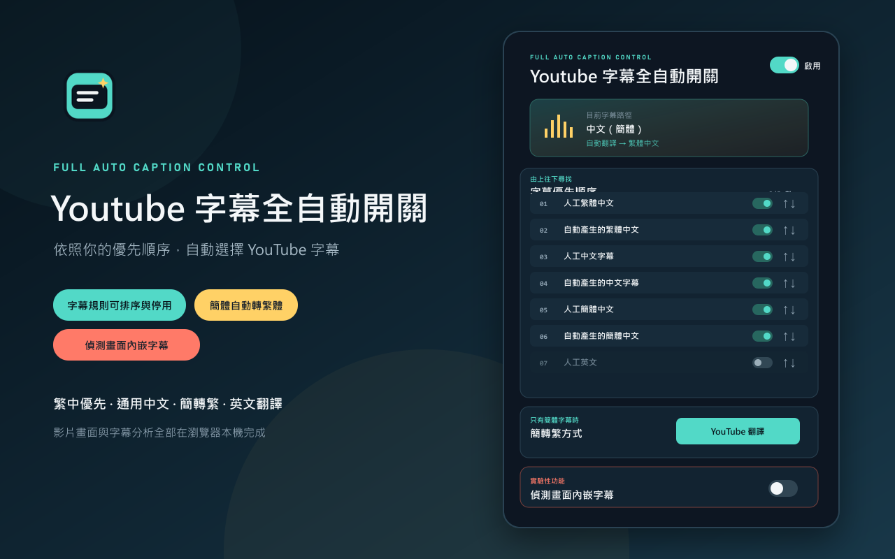

# Youtube 字幕全自動開關

[繁體中文](#繁體中文預設) · [English](#english)



## 繁體中文（預設）

「Youtube 字幕全自動開關」是以 Chrome Manifest V3 正式版為主、並共用核心支援 Safari Mac 開發版的瀏覽器擴充功能，會依照使用者設定的優先順序，自動為 YouTube 影片選擇、開啟或關閉最合適的字幕。目前不製作 iPhone 或 iPad 版本。

### 主要功能

- 預設依序尋找中文繁體字幕、中文字幕、中文簡體字幕及粵語字幕；英文與其他可翻譯語言預設停用。
- 明確辨識繁體 `zh-Hant`／`zh-Hant-TW`／`zh-TW`／`zh-HK`／`zh-MO`、簡體 `zh-Hans`／`zh-Hans-CN`／`zh-CN`／`zh-SG`、通用 `zh` 及粵語 `yue`／`yue-Hant` 字幕軌。
- 通用 `zh` 預設也會執行簡轉繁；另可選擇「僅處理確認簡體字幕」，或改為「全部中文強制轉換」，連明確繁體字幕也送入所選的簡繁轉換流程。三種範圍為互斥選項。
- 只有簡體字幕時，預設使用 YouTube 自動翻譯為繁體中文，也可改用 OpenCC 在本機轉換。
- VIP 登入並完成購買後，選擇「本機轉換」可使用 OpenCC `twp` 將字幕中的中國用語轉為台灣慣用詞，例如「信息 → 資訊」與「保存 → 儲存」。
- VIP「香港口語轉普通話」同樣只在本機轉換模式開放；內建保守的高頻口語規則，避免直接替換容易誤判的單字。
- VIP 在本機轉換模式支援最多 100 條自訂詞彙替換，可逐條啟用、停用、排序與刪除；使用 YouTube 翻譯時保留規則但不套用。
- VIP 支援以穩定的 YouTube 頻道 ID 建立最多 50 條「指定頻道規則」，每個頻道可選擇「停用全部功能」、「強制開啟字幕」、「強制關閉字幕」、「強制開啟字幕 + 簡繁轉換」或「強制開啟字幕 + 簡繁粵語轉換」；強制模式都不進行 OCR，規則可保存在本機並選用 VIP 雲端同步。
- VIP 終身版以 Google 帳號綁定身分；網站提供 Lemon Squeezy 線上付款、匯款後人工確認、會員訂單查詢與管理後台。插件登入購買時的同一帳號後驗證 VIP，目前暫不限制設備數量。
- 每一條字幕規則都能調整順序，並可個別啟用或停用。
- 「英文字幕」、「自動產生的英文字幕」及「其他可翻譯語言字幕」預設停用，需要時才開啟。
- 支援 YouTube 單頁式網站切換影片，不必重新載入擴充功能。
- 總開關開啟時顯示彩色工具列圖示，關閉時顯示黑白圖示。
- 面板會在開啟及切換總開關時，以動態像素資料直接校正工具列圖示，背景服務也會依儲存設定再次同步；停用時另顯示 `OFF` 徽章。
- 可選擇啟用實驗性的畫面內嵌字幕偵測。偵測到影片已有圖形字幕時，會自動關閉 CC，避免字幕重疊。
- 內嵌字幕偵測預設開啟；「有簡體 CC、沒有繁體字幕時略過偵測」預設關閉，需要時可在面板中開啟。字幕翻譯、簡轉繁、地區用語與自訂替換不受此選項影響。
- 影片沒有任何 CC 字幕軌時不會啟動畫面擷取或 OCR 取樣，以節省資源。
- 內嵌字幕判斷最早可在第三段有效 CC 字幕完成，判斷結束後停止持續監控以節省資源。
- 分頁進入背景、沒有 CC、OCR 判斷完成或總功能關閉時會解除字幕監聽；若已選擇本機轉換，為了持續處理後續字幕，OCR 完成後仍保留必要的文字轉換監聽。
- OpenCC 詞庫只在選擇「本機轉換」且字幕實際需要轉換時載入目前 YouTube 分頁；預設 YouTube 翻譯模式不載入詞庫。
- 執行狀態沒有變化時不會重複寫入 `chrome.storage.local`。

### 預設字幕規則

1. 中文繁體字幕
2. 中文字幕
3. 中文簡體字幕
4. 粵語字幕
5. 英文字幕（預設停用）
6. 自動產生的英文字幕（預設停用）
7. 其他可翻譯語言字幕（預設停用）

全自動簡轉繁預設使用 YouTube 翻譯，並預設選擇「未定義簡繁中文強制轉換」。

地區用語只會在選擇「本機轉換」時執行。字幕文字的後處理順序為「香港口語 → 台灣用語 → 自訂替換」，因此自訂規則可以覆寫內建結果。香港口語轉換牽涉語境與粵語語法，預設關閉並標示為實驗性功能。

### 安裝 Release 版本

1. 從 [Releases](https://github.com/ahui3c/youtube-subtitle-auto-switch/releases) 下載最新 ZIP。
2. 解壓縮 ZIP。
3. 在 Chrome 開啟 `chrome://extensions`。
4. 開啟「開發人員模式」。
5. 選擇「載入未封裝項目」，再選取解壓縮後包含 `manifest.json` 的資料夾。

### 開發與建置

```powershell
pnpm install
pnpm run test
pnpm run build:chrome
pnpm run build:safari
```

Chrome 建置仍輸出到 `dist`；Safari Mac 的共用核心建置輸出到 `dist-safari`。Safari 正式封裝與簽署必須在 Mac 上透過 Xcode 的 `safari-web-extension-packager` 完成，請參閱 [`docs/safari-macos.md`](docs/safari-macos.md)。Safari Mac 的內嵌字幕偵測暫列為實驗性功能。

目前測試涵蓋字幕優先順序、個別規則開關、通用中文字幕、OpenCC 台灣慣用詞、香港常見口語、自訂替換、背景擷取授權、工具列圖示狀態，以及內嵌字幕影像判斷。

### 權限與隱私

- `storage`：保存字幕偏好、功能開關、自訂替換規則、指定頻道的 ID／名稱／規則類型與本機執行狀態。一般設定使用 Chrome 同步儲存；自訂詞庫與頻道規則為避免同步容量限制，只保存在目前瀏覽器。
- `activeTab`：啟用內嵌字幕偵測時，擷取目前可見的 YouTube 分頁供本機分析。
- `scripting`：只在本機字幕轉換實際需要時，將擴充功能套件內附的 OpenCC 詞庫載入目前 YouTube 分頁；不下載或執行遠端程式碼。
- `identity`：開啟網站上的 Google 登入與插件連接流程；插件不取得 Google 密碼。
- `https://www.youtube.com/*`：只在 YouTube 頁面讀取字幕軌、控制字幕與檢查播放器狀態。
- `https://myapp.ahui3c.com/*`：驗證登入帳號與 VIP 授權狀態，並開啟會員中心；字幕文字、影片畫面與 OCR 結果不會傳送到此網站。

字幕內容、影片畫面與分析結果只在使用者的瀏覽器本機處理，不會傳送給開發者或第三方。完整內容請參閱[隱私權政策](https://ahui3c.github.io/youtube-subtitle-auto-switch-privacy/)。

### 內嵌字幕偵測說明

此功能只在有效 CC cue 出現時分析影片底部區域，優先直接讀取影片影格，因此不包含播放器的 CC 圖層。若影片禁止直接讀取影格，才改用分頁截圖並平滑遮罩原生 CC 區域。

這不是完整 OCR。字幕樣式、背景、影片比例、新聞跑馬燈、遊戲 HUD 或歌詞都可能影響判斷，因此此功能預設關閉。

### 已知限制

YouTube 沒有公開提供指定字幕軌的正式 Web Player API。本擴充功能透過播放器網頁介面的字幕模組套用字幕軌；YouTube 改版後可能需要更新介接程式。

---

## English

**Youtube Subtitle Auto Switch** is a Chrome Manifest V3 extension that automatically selects, enables, or disables the most suitable YouTube caption track according to a user-configurable priority list.

### Features

- Prioritizes Traditional Chinese, generic Chinese, Simplified Chinese, and Cantonese captions; English and other translatable languages are disabled by default.
- Recognizes `zh-Hant`/`zh-TW`, `zh-Hans`/`zh-CN`, generic `zh`, and `yue`/`yue-Hant` caption families.
- Converts generic `zh` captions by default, with mutually exclusive modes for confirmed Simplified only or every Chinese caption—including explicitly Traditional tracks.
- Uses YouTube translation to Traditional Chinese by default when only Simplified Chinese captions are available; local OpenCC conversion is also available.
- VIP unlocks OpenCC Taiwan phrases, conservative Hong Kong colloquial replacements, up to 100 custom replacement rules, and up to 50 per-channel rules.
- VIP identity is linked to a Google account. The website supports Lemon Squeezy checkout, manually verified bank transfers, account order history, and admin review. Device count is currently not limited.
- Every caption rule can be reordered or individually enabled and disabled.
- Manual English, automatic English, and other translatable languages are disabled by default.
- Supports YouTube's single-page navigation between videos.
- Shows a colored toolbar icon while enabled and a grayscale icon while disabled.
- Includes an optional experimental detector for burned-in captions. When embedded captions are detected, YouTube CC is disabled to prevent duplicated subtitles.
- By default, embedded-caption detection is skipped when a video has Simplified Chinese CC but no Traditional Chinese track. Caption translation and local text post-processing continue normally, and this exception can be disabled.
- When a video has no CC tracks, screen capture and OCR sampling are never started—even under a per-channel Force OCR rule—to conserve resources.
- Embedded-caption detection can finish as early as the third valid caption cue and stops monitoring after a decision to reduce resource usage.

### Install a Release Build

1. Download the latest ZIP from [Releases](https://github.com/ahui3c/youtube-subtitle-auto-switch/releases).
2. Extract the archive.
3. Open `chrome://extensions` in Chrome.
4. Enable **Developer mode**.
5. Choose **Load unpacked** and select the extracted folder containing `manifest.json`.

### Build from Source

```powershell
pnpm install
pnpm run test
pnpm run build
```

Load the generated `dist` directory as an unpacked extension.

### Permissions and Privacy

- `storage`: Saves caption preferences, feature toggles, custom replacement rules, channel IDs/names/rule modes, and local runtime status. Custom rules and channel rules stay in the current browser to avoid sync-storage limits.
- `activeTab`: Captures the visible YouTube tab for local embedded-caption analysis when the optional detector is enabled.
- `identity`: Opens the website-based Google sign-in and extension authorization flow.
- `https://www.youtube.com/*`: Reads caption tracks and player state and applies caption choices only on YouTube.
- `https://myapp.ahui3c.com/*`: Verifies the signed-in account and VIP entitlement; captions and video frames are never uploaded to this service.

Caption text, video frames, and analysis results are processed locally in the browser and are not sent to the developer or third parties. See the full [Privacy Policy](https://ahui3c.github.io/youtube-subtitle-auto-switch-privacy/).

### Known Limitation

YouTube does not provide a public Web Player API for selecting a specific caption track. This extension uses the caption module exposed by the YouTube player page, so future YouTube changes may require compatibility updates.
